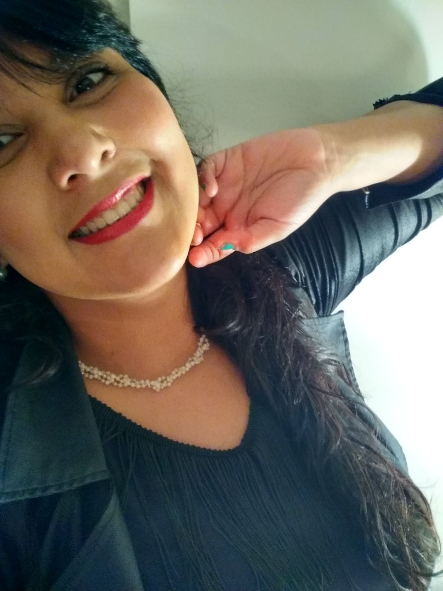

# Introducción:

## Descripción:

Este es un proyecto js de rolling code, la cual se trata de las mejores bebidas del mercado actual, tiene un login, un registrer, un buscador de bebidas, hicimos este proyecto como una buena oportunidad de mostrar nuestros conocimientos.
 
 
La pagina desarrollada es una pagina que contiene recetas de diversos tragos, los cuales están divididos en 3 secciones. La sección de los mejores tragos del 2021, tragos con gin y tragos con vodka.
 

<h1 align="center" style="color: #339cff">Desarrolladores</h1>
 

	
	
	
	

 
 
 

## Uso

En la misma, dependiendo el tipo de usuario que sea, podrás ver imagenes de los tragos y las recetas de como prepararla. En caso de ser administrador, podrás agregar nuevos tragos, editar los mismos o borrar alguno de los ya existentes.

 
 

# Tecnologías

<h2 align="center" style="color: #339cff; font-size:30px">Front-end</h2>

 
 
 

